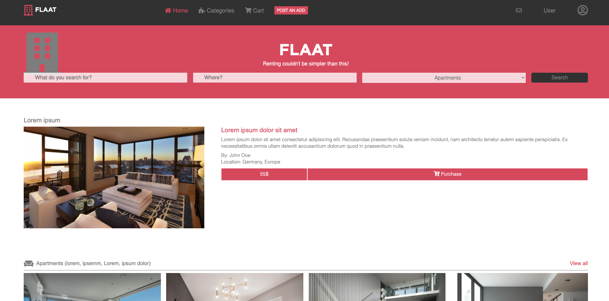

# Plain HTML/CSS Project

> The project is a mock up CSS inspired by ZATTIX (Design idea by Mohammed Awad on Behance).

This project is actually built with plain CSS and HTML.

## Built With

- HTML5 & CSS 3
- Frameworks: NOPE

## Live Demo

[Live Demo Link](https://samanatashi.github.io/HTML-CSS-Design-Project/)

## 👤 **Saman**

- GitHub: [@SamanAtashi](https://github.com/SamanAtashi)
- Twitter: [@AtashiSaman](https://twitter.com/AtashiSaman)
- LinkedIn: [@saman-atashi](https://www.linkedin.com/in/saman-atashi-9539911b0)

## 🤝 Contributing

Contributions, issues, and feature requests are welcome!

## Show your support

Give a ⭐️ if you like this project!

## Acknowledgments
